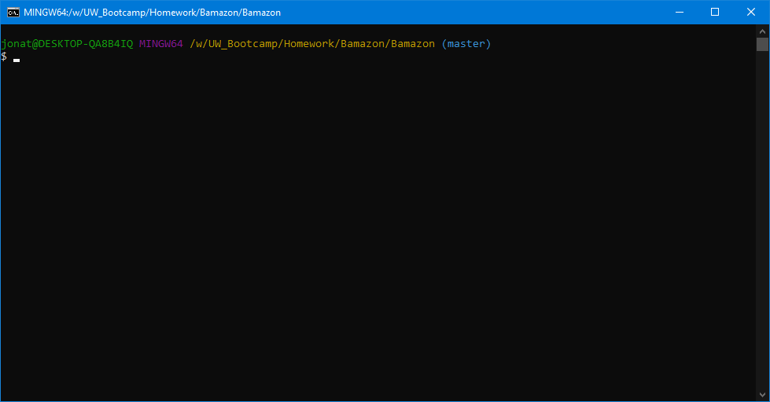

# Bamazon

## Summary
This is a set of command line interfaces to mimic a storefront where customers can purchase products, managers can manage inventory, and supervisors can manage departments.

## Overview
Created using Node.js, this app takes user input via the command line and conducts the relevant actions based on user responses to menus.

## Preview


## Installation

From inside **Git Bash**, enter in the following line by line:

```
git clone https://github.com/j-sea/Bamazon.git
cd Bamazon
mysql -u USERNAME -p"PASSWORD"
source bamazon-schema.sql
source bamazon-seeds.sql
quit
npm install
```

## Run Customer Interface

```
node bamazonCustomer.js
```

Follow the command line menus

## Run Manager Interface

```
node bamazonManager.js
```

Follow the command line menus

## Run Supervisor Interface

```
node bamazonSupervisor.js
```

Follow the command line menus

## Node.js Package Dependencies

* `mysql`
* `inquirer`

## About

This app was programmed by Jonathan Chan.

For help on this project, you can send an email towards jsea@uw.edu.